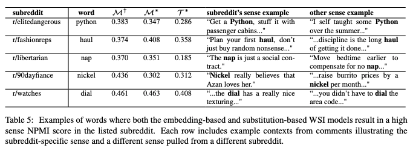

# Characterizing English Variation across Social Media Communities with BERT
Authors: **Li Lucy, David Bamman**

Venue: *TACL 2021*

Link: [arXiv](https://arxiv.org/abs/2102.06820)

Topics: sociolinguistics, social media, NLP, BERT

## Summary

The authors analyze the differences in word senses across English Reddit communities with BERT. They find distinctive word-sense use in medium-sized high engagement communities. They leverage the structure of topic-specific subreddits to collect comments that are segmented across a variety of topics. Many of these subreddits contain user-maintained glossaries and wikis of specialized terminology and acronyms, which they gather manually and filter out external-facing examples.

They perform a frequency-based analysis of terms in subreddits to assess term specificity to a community using NPMI, which comes very high for botanical terminology in r/gardening, and acronyms for popular PlayStation game titles in r/ps4. They also assess TF-IDF, TextRank (based on PageRank), and Jensen-Shannon divergence (symmetric KLD) to compare the distance between two subreddit's term distributions. When first introduced, they compute all of these using probabilities assessed by simple frequentist word counting.

However, there is a problem with these simple frequentist analyses---differences in word sense between communities are significant. For example "ow" can refer to the videogame Overwatch (r/overwatch) a clothing brand (r/sneakers) or "opening week" (r/boxoffice). To overcome this they frame their task as word sense induction (WSI) from BERT embeddings.

Among the techniques they employ to do this are knn clustering on BERT embeddings and spectral clustering using a Graph Laplacian produced via a similarity matrix of embeddings. They use SemEval tasks to evaluate the performance of their WSI before turning to employing it in the study of the Reddit communities.

## Thoughts

> For our type-based analysis, we only examine words that are within the 20% most frequent in a subreddit; even though much of a community's specific language is in its long tail.

Once they got to the point of discussing the difference in uses of ow, the significance of looking at *word sense* specifically clicked for me. At first I was a bit confused about why that was so valuable.

This is a WIP summary. I will keep adding to it (as of Jun 5 2021)