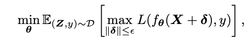
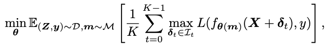
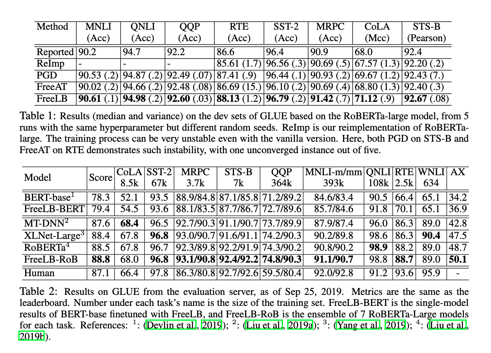

# FreeLB: Enhanced Adversarial Training for Natural Language Understanding
Authors: **Chen Zhu, Yu Cheng, Zhe Gan, Siqi Sun, Tom Goldstein, Jingjing Liu**

Venue: *ICLR 2020*

Link: [arXiv](https://arxiv.org/pdf/1909.11764.pdf)

Topics: adversarial training, language models

## Summary

Initially introduced in the image domain, adversarial training is recognized as a change that improves robustness, but hurts generalization. However, in the language modeling domain, adversarial training has been shown to improve both attributes. The authors introduce an adversarial training algorithm called FreeLB (free large batch) that adds perturbations to input word embeddings and minimizes adversarial loss. They validate the effectiveness of the improvements of FreeLB generalization in terms of invariance in the embedding space. Additionally, their strategy advanced then-SOTA on GLUE for BERT-base, accuracy for RoBERTa-large on its training tasks as well as ARC and CommonsenseQA.

Constructing label-preserving adv. ex.s is known to be hard without a human in the loop. To get around this they produce "virtual" examples directly in the embedding space, rather than out of real words. Bounded by some norm, they add adversarial perturbations to the embeddings of the inputs using the loss gradients. This reminds me of other work on adversarial training I've seen previously. (oh, the [citation](https://arxiv.org/abs/1605.07725) was right after I read that sentence). The problems with prior work on this topic were that they required an internal loop applying PGD on multiple (*k*)) forward and backward steps per optimization step (forward to get initial gradient, backward to get adversarial perturbation, forward again with perturbation added, backward again to get actual loss for parameter update) or cheated with potential "stale gradients," or with assumptions including limitations such as not  being theoretically justified for ReLU-based NNs that can't be double differentiated.

To get around these issues they cast their algorithm as training on a virtually factor-of-*k*-larger dataset of adversarial examples. When they perform each of the iterations in PGD to produce the adversarial perturbations, they accumulate the parameter gradients produced along the way. Each of the *k* virtual batches is equivalent to the input batch ***X*** plus the *i*th adversarial perturbation *δi*. Essentially they approximate the inner max of PGD by averaging over the *K* loss values.

This leads to empirically improved results.

## Thoughts

I'm a bit skeptical of the "Free" claim here. Yes, it's at no additional training cost over just repeating the same optimization step *k* repeated times per batch without adversarial perturbation, but this feels like an apples-to-oranges comparison, as nobody would do this *k*x training strategy on the "clean" data. However, the empirical results are solid. This is a theoretically well-justified way to perform adversarial perturbation that indeed drives better generalization performance.