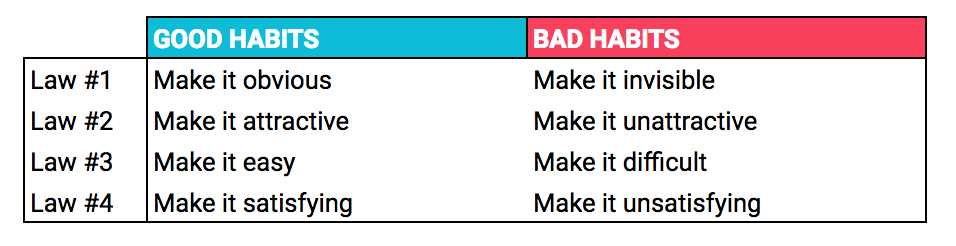

# Michael's Reading Notes

## By Month

[June 2021](2106/README.md)

## Motivation
Trying to hack a stronger continuous paper reading habit with the green squares. To do this, I'm trying to _make it satisfying_ and _easy_ by building a simple living document that I can update with just a web browser, that tracks progress. As an added bonus, I'll get some valuable technical writing and Markdown practice. By making this repo public, I'm committing to try to update it regularly, thereby making it an even more _attractive_ habit. 

Eventually, I might list papers by date of publication and by topic, but for now I'll just do one short markdown file per paper, sorted in folders by-month-I-read. I might even use these as starting points for fleshed out lit review documents or blog posts.

**If you aren't me, and are reading the things I write here, please don't be too harsh a judge!!! I don't plan to promote this repo, it's mainly public for my easy access, and the higher stakes of doing writing in semi-public. Forgive me for the many errors it doubtless contains.**